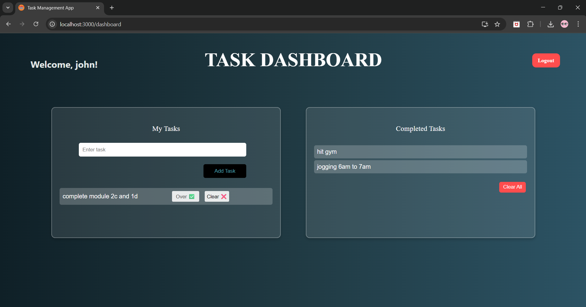

# Task Management System ✅

A simple and interactive web-based productivity app that helps users create, manage, and complete tasks efficiently.

## 🔧 Tech Stack
- React
- JavaScript
- CSS

## 🌟 Features
- ➕ Add new tasks
- 📝 Edit existing tasks
- ✅ Mark tasks as complete/incomplete
- 🔐 Login system using email and password
- 📊 Task dashboard with interactive UI

## 🚀 How to Run Locally

```bash
git clone https://github.com/K-2804/Task-Management.git
cd frontend
npm install
npm start
```

##Screenshots

### 🔐 Login Page


### 🔐 Signup Page


### 📋 Task Dashboard Page


### 📋 Task Page

